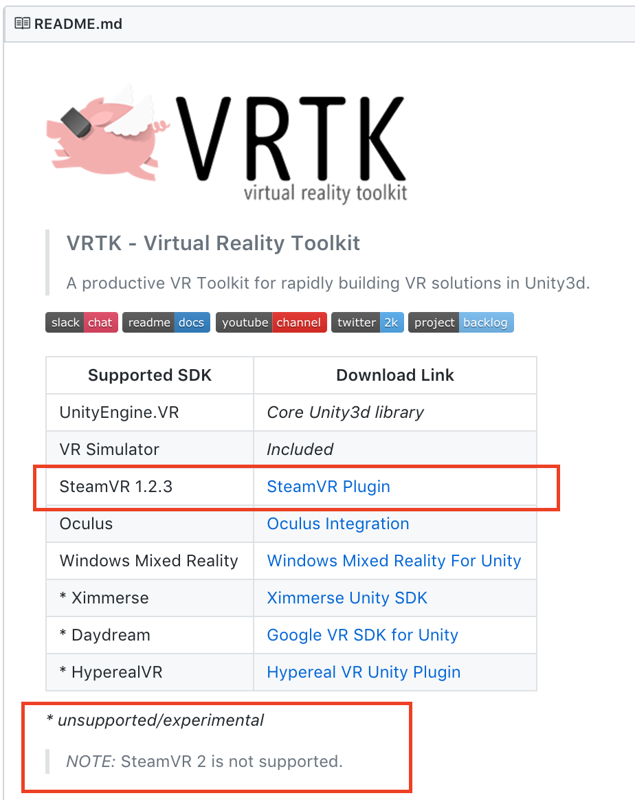

# ATS ARTTECH 4135-001: Virtual Reality

## assignment4 VRTK and SteamVR

>VRTK offers a VR Simulator that works without any third party SDK, but VR device support requires a supported VR SDK to be imported into the Unity project.

In this assignment you will start with the github classroom link, work on your **assignment2** repository, download package to your computer, make modifications to the unity project, commit the changes, and push back the updated repository to github.

## Potential Resources:
> For this assginment, is higliy recommended looking into  VRTK-Master, Example 004 & 006 Locomotion.

- [VRTK - Virtual Reality Toolkit Website](https://vrtoolkit.readme.io)
- [VRTK - Virtual Reality Toolkit Documentation](https://vrtoolkit.readme.io/docs)
- [VRTK - Virtual Reality Toolkit YouTube Channel](https://www.youtube.com/channel/UCWRk-LEMUNoZxUmY1wO7DBQ)

- [VRTK - Pointers, Teleporting, and Object Interactions](https://youtu.be/sW9lxEUXfe8)
- [VRTK - Teleporting Tutorial(s)] (https://youtu.be/2IWAwFDhX2M) - There are multiple videos in series.
- [VRTK- Locomotion Tutorial(s)] (https://youtu.be/1rtXMzc2mfI) - There are multiple videos in series.

You should also feel free to watch anything else you find helpful, post to slack if you find good videos/tutorials/websites.

## Learning Outcomes
- In class you learned how to setup STEAM VR libraries to navigate an environment in VR. On this assignment you will learn the ability to setup a VR project using VRTK.

## Instructions:

### Getting VRTK ready for Unity

1. Open your project Assignment 2 (The unity puzzle)
2. Download VRTK 
  * [video help](https://youtu.be/tyFV9oBReqg)
	* https://github.com/thestonefox/VRTK
3. Import the Assets/VRTK folder into your Unity project
	* Assets/VRTK
	3.1. Have a look at the included example scenes, in particular at the locomotion scenes (VRTK/Examples/004-Locomotion Teleporting & 006-Locomotion MovementTypes)
4. Download **SteamVR V 1.2.3** from the [link provided in GitHub](https://github.com/ValveSoftware/steamvr_unity_plugin/releases/download/1.2.3/SteamVR.Plugin.unitypackage)

5. Import SteamVR into your Unity Assets Folder
	* Asstes/SteamVR
6. Make a new scene and save it as **Assignment4Scene** 
  * design a simple labyrinth of min 50 x 50 units, max 200 x 200 
  a* consider environment settings like skyboxes, lighting, and the mood you want to convey when creating your environment.
7. Save your scene/project
8. Take a screenshot (assignment4.png) and place it in Assets folder
8. Commit changes to repository, remember to add a useful commit message(s).
9. Push committed changes to GitHub.

## Bonus
### Addinng Navigation to your labyrinth 
1. Setting up VRTK in your scene 
  * Look at minute 5:00 from [this video](https://youtu.be/tyFV9oBReqg)
2. Add navigation using [teleporting](https://youtu.be/2IWAwFDhX2M) to your scene 
3. Save your scene/project
8. Take a screenshot (assignment4a.png) and place it in Assets folder
4. Commit changes to repository, remember to add a useful commit message(s).
5. Push committed changes to GitHub.

